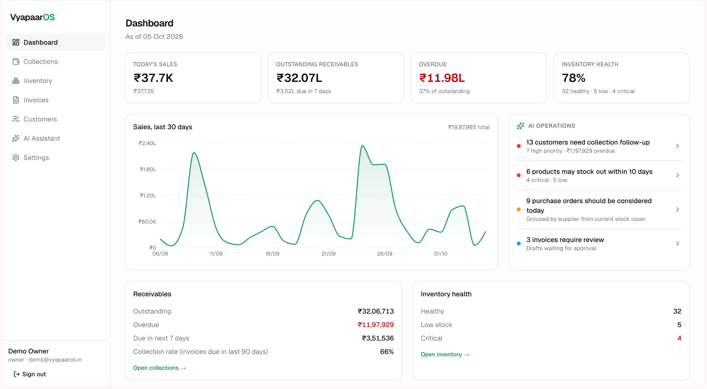
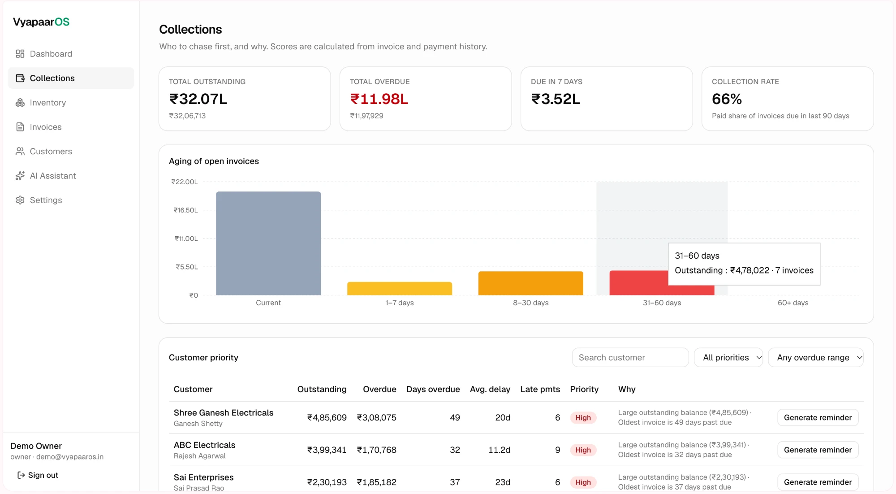
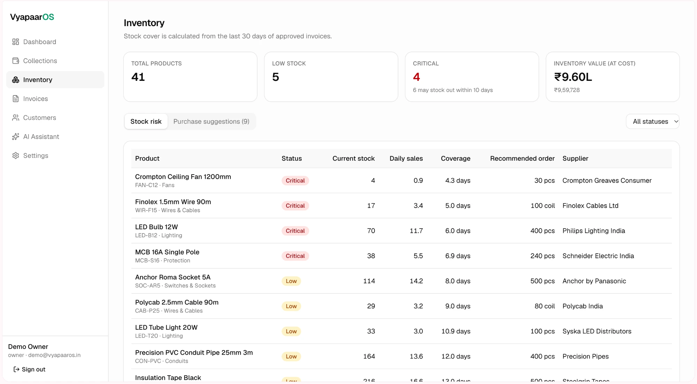
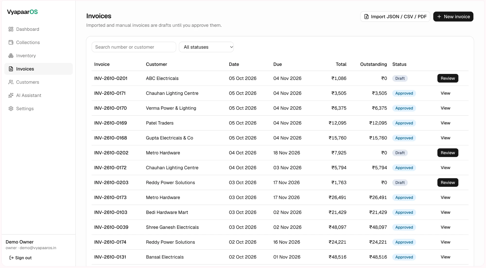
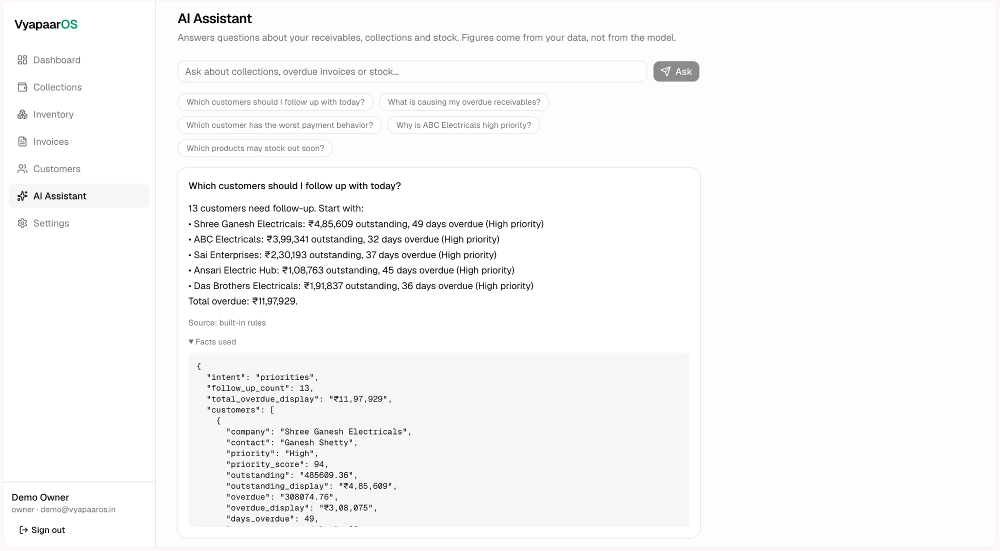
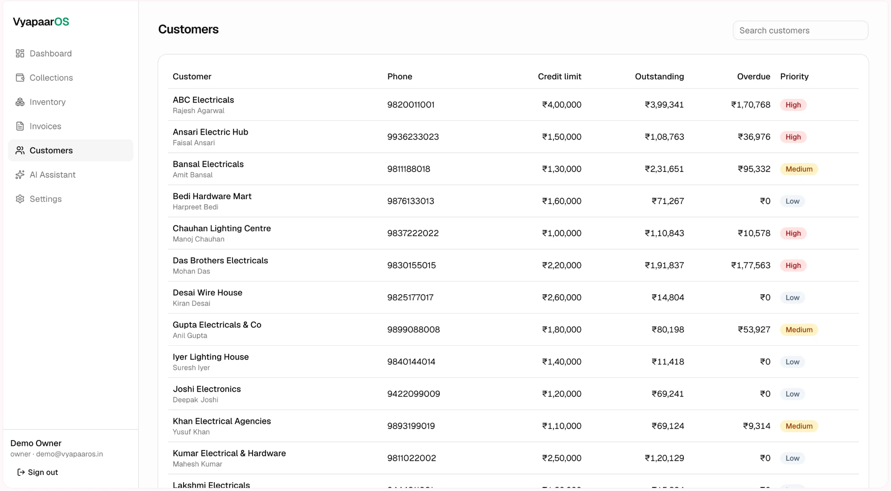
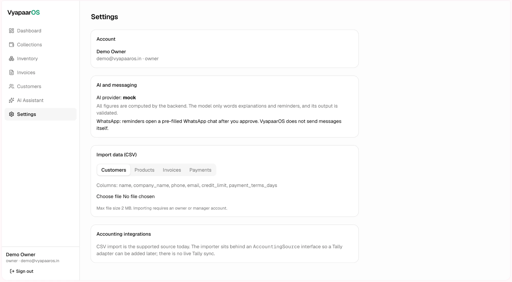
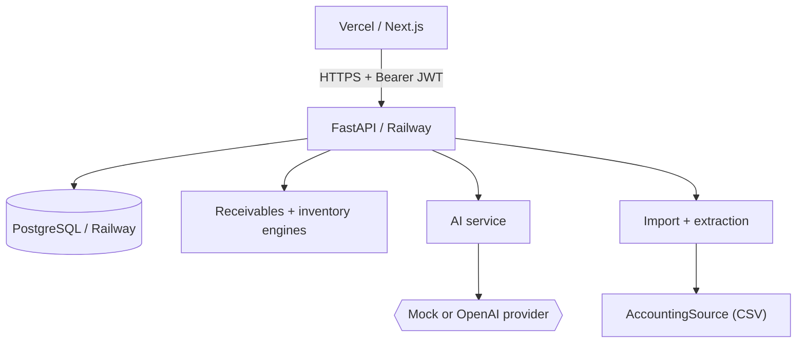

# VyapaarOS

**AI-assisted business operations for Indian distributors and retailers.**

[**Try it live**](https://vyapaar-os-ivory.vercel.app)

## Problem
Small distributors invoice on credit, chase payments by phone and WhatsApp, and reorder stock from memory. The data to do this well already exists in invoices and payments, but nobody has time to turn it into a daily list of what needs attention. VyapaarOS does that, and explains why each item is on the list.

> Scope: a focused MVP, not an ERP and not a Tally replacement.

## What it does
1. **Invoice → review → approval.** Import JSON, CSV or a text PDF (or type one in). Each becomes a draft. Nothing enters the business data until a manager approves it.
2. **Inventory → stock-out intelligence.** Sales velocity from invoice history gives coverage days, a Healthy / Low / Critical status and a recommended order, grouped by supplier.
3. **Receivables → collection priority → reminder.** Customers are scored High / Medium / Low with plain-language reasons. A polite WhatsApp reminder is drafted for the user to edit, copy and approve.

## Screenshots

### Dashboard


### Collections Intelligence


### Inventory Intelligence


### Invoice Review


Imported and manual invoices stay as drafts until approved; **Review** opens the draft with Approve / Edit / Reject.

### AI Assistant


### Customers


### Settings


## Architecture

Layers in the backend: `api/` (HTTP only) → `services/` (business logic) → `repositories/` (SQL) → `models/`. More in [docs/architecture.md](docs/architecture.md); business rules in [docs/product.md](docs/product.md).

## AI architecture
```
Business data (PostgreSQL)
  ↓
Deterministic calculations   (plain Python, no LLM)
  ↓
Structured facts             (a fixed set per question)
  ↓
LLM provider                 (explains the facts, under strict prompts)
  ↓
Validation                   (numbers must exist in the facts; reminders must carry the real invoice and amount)
  ↓
User
```
**The LLM never calculates financial or inventory metrics.** Outstanding amounts, days overdue, payment delay, priority, sales velocity, coverage and reorder quantities are all computed in `services/receivables.py` and `services/inventory.py`. If the provider fails or its output fails validation, the response falls back to a deterministic template. Prompts live in `services/ai/prompts.py`, separate from business logic. The AI code is behind one interface (`AIProvider`) with a mock and an OpenAI implementation.

## Features
- Dashboard: KPIs, 30-day sales chart, receivables and stock health, and an AI Operations card whose counts come from the same engines as the detail pages and link to the filtered records
- Collections: aging buckets, collection rate, priority table with reasons; filter by priority, overdue range and customer
- Customer detail with the explained priority, invoices and payments
- Reminder generator: Regenerate, Edit, Copy. Approving opens a pre-filled WhatsApp chat; the user sends it
- Inventory: velocity, coverage, status, recommended order, sortable risk table, purchase suggestions by supplier
- Invoices: manual entry, JSON / CSV / text-PDF import, draft review with Approve / Edit / Reject
- CSV import for customers, products, invoices and payments, with preview and per-row errors
- AI assistant for business questions, with the facts used shown
- JWT login with owner / manager / sales roles enforced by the API

## Tech stack
- **Frontend:** Next.js (App Router), TypeScript, Tailwind CSS, shadcn/ui, Recharts, React Hook Form, Zod, Vitest and Testing Library
- **Backend:** Python 3.11, FastAPI, Pydantic, SQLAlchemy 2, Alembic, pytest, ruff, mypy
- **Database:** PostgreSQL (UUID primary keys)
- **AI:** OpenAI SDK behind a provider interface; deterministic mock provider
- **Deploy:** Vercel (frontend), Railway (API and PostgreSQL), Docker for the API and for local development

## Demo account
**Demo account: sample data only.** Seeded sample data for a fictional electrical distributor.
- Email: `demo@vyapaaros.in`
- Password: shared with reviewers on request

The `manager@vyapaaros.in` and `sales@vyapaaros.in` accounts are seeded with the same password. Roles: owner and manager can approve invoices, record payments and commit imports; sales is read and draft only.

## Local development
Prerequisites: Docker and Node 20+.
```bash
git clone https://github.com/HarshitaSobhani/vyapaarOS.git && cd vyapaarOS
cp .env.example .env                  # set DEMO_USER_PASSWORD (any value) and optionally SECRET_KEY

docker compose up -d --build          # PostgreSQL + API at http://localhost:8000 (migrations run on start)
docker compose run --rm backend python -m app.seed   # demo data; refuses to run on a non-empty database

cd frontend
cp .env.example .env.local            # NEXT_PUBLIC_API_URL=http://localhost:8000
npm install
npm run dev                           # http://localhost:3000
```
API docs (development only): http://localhost:8000/docs. Without Docker you need a local PostgreSQL:
```bash
cd backend && python3.11 -m venv .venv && . .venv/bin/activate
pip install -r requirements-dev.txt
cp .env.example .env                  # DATABASE_URL, SECRET_KEY, DEMO_USER_PASSWORD
alembic upgrade head && python -m app.seed      # add --reset to wipe and re-seed (development only)
uvicorn app.main:app --reload
```
Checks:
```bash
cd backend  && pytest && ruff check . && mypy app   # needs PostgreSQL; set TEST_DATABASE_URL to a throwaway database
cd frontend && npm test && npm run lint && npm run typecheck && npm run build
```
Sample files for the import features are in [data/seed/](data/seed/).

## Production deployment
Production: **Vercel (Next.js) → Railway (FastAPI) → Railway (PostgreSQL)**.

**Railway (API + database)**
1. New project → add the PostgreSQL service → add a service from this GitHub repo with **Root Directory** `backend` (uses `backend/Dockerfile` and `backend/railway.json`). Generate a public domain.
2. Variables on the API service:

| Variable | Value |
|----------|-------|
| `DATABASE_URL` | `${{Postgres.DATABASE_URL}}` |
| `SECRET_KEY` | long random string (`python -c "import secrets; print(secrets.token_urlsafe(48))"`) |
| `ENVIRONMENT` | `production` |
| `CORS_ORIGINS` | the Vercel URL, e.g. `https://vyapaar-os-ivory.vercel.app` (comma-separated for several) |
| `AI_PROVIDER` | `mock` (default) or `openai` |
| `OPENAI_API_KEY` | only with `openai`; stays on Railway |
| `DEMO_USER_PASSWORD` | password for the seeded demo accounts |
| `PORT` | `8000` (the start script uses `$PORT`) |

3. On every start the container runs `alembic upgrade head` and then `uvicorn app.main:app --host 0.0.0.0 --port $PORT` (`backend/start.sh`). Check `GET /health` and `GET /health/db`.
4. Seed once: set `RUN_SEED=true`, let it redeploy, then set it back to `false` (the seed also refuses to run on a non-empty database). `--reset` is blocked in production.

**Vercel (frontend)**
1. Import the GitHub repo, **Root Directory** `frontend`.
2. Environment variable `NEXT_PUBLIC_API_URL` = the Railway API URL, e.g. `https://api-production-4dd4f.up.railway.app` (no trailing slash). Only the public API URL goes here.
3. After the first deploy, put the Vercel URL into `CORS_ORIGINS` on Railway. Preview deployments use different URLs and must be added there too.

Auth is a bearer token in the `Authorization` header (kept in `localStorage`), so it works across `vercel.app` and `up.railway.app` without third-party cookies.

## Environment variables
Templates: `.env.example` (docker compose), `backend/.env.example`, `frontend/.env.example`. Real `.env*` files are git-ignored.
Backend: `DATABASE_URL`, `SECRET_KEY`, `CORS_ORIGINS`, `ENVIRONMENT`, `AI_PROVIDER`, `OPENAI_API_KEY`, `OPENAI_MODEL`, `DEMO_USER_EMAIL`, `DEMO_USER_PASSWORD`, `JWT_EXPIRE_MINUTES`, `MAX_UPLOAD_BYTES`, `MAX_IMPORT_ROWS`, `PORT`, `RUN_SEED`.
Frontend: `NEXT_PUBLIC_API_URL` (public), `API_URL` (optional, server-side).

## Limitations
- The deployed demo uses the **mock AI provider**: answers and reminders are deterministic templates filled with real figures. The OpenAI provider is implemented and unit-tested against a fake client, but has not been exercised against the live API.
- **No WhatsApp sending.** Approving a reminder opens a pre-filled WhatsApp chat; the user presses Send. No WhatsApp Business API.
- **No live Tally sync.** The importer is built on an `AccountingSource` interface so a Tally adapter can be added later ([docs/integrations/tally.md](docs/integrations/tally.md)); only CSV is implemented.
- **No OCR.** PDF import reads text PDFs only; scanned images are rejected.
- Keyword-based question routing in the assistant, not language understanding.
- No login rate limiting, no refresh tokens or password reset, single organisation. The token is stored in `localStorage`.
- Customer-level payment allocation (oldest invoice first) is available through the API only, with no UI.

## Future work
Tally adapter, WhatsApp Business API provider, payment links, background workers for large imports, login rate limiting.
