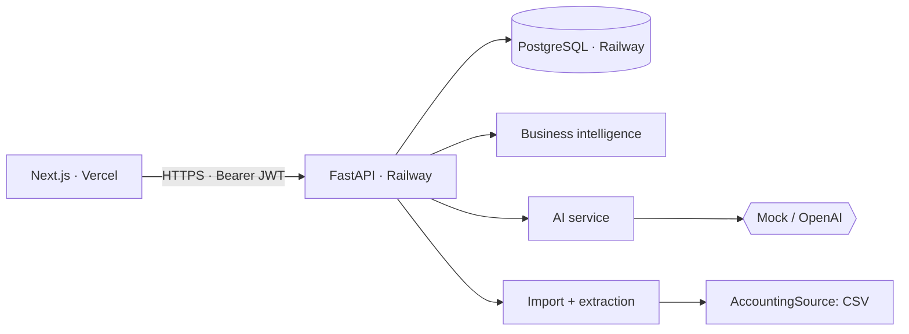

# VyapaarOS

AI-assisted business operations for Indian distributors and retailers. Small businesses invoice on credit,
chase payments over WhatsApp and reorder stock from memory. VyapaarOS turns invoices, payments and stock
into a short list of things that need attention, and explains why.

> Portfolio MVP. It is not an ERP and not a Tally replacement. All figures are calculated by deterministic backend code;
> the language model only words explanations and reminders.

## Why this exists
A typical electrical distributor has a few hundred open invoices, a dozen slow payers and a few fast-moving
SKUs that stock out. The owner knows this in their head but has no daily view of it. The three workflows here
each remove one recurring task:

1. **Invoice → structured data → human approval**: import JSON/CSV/text-PDF, review the draft, approve or reject.
2. **Inventory → stock-out and reorder intelligence**: sales velocity from invoice history, coverage days, suggested order quantities grouped by supplier.
3. **Receivables → collection priority → WhatsApp-ready reminder**: a scored, explained list of who to chase.

## Features (all implemented and covered by tests or a browser run)
- Login with JWT, roles (owner / manager / sales; only owner/manager approve invoices or commit imports)
- Dashboard: KPIs, 30-day sales chart, receivables and stock health, **AI Operations** card whose counts come from the same engines as the detail pages and link to the filtered records
- Collections: aging buckets, collection rate, customer priority table (High/Medium/Low with reasons), filters by priority, overdue range and customer
- Customers: list and detail with explained priority, invoices and payments
- WhatsApp reminder generator: Regenerate, Edit, Copy message, and "Approve & open WhatsApp" (opens a pre-filled chat; **nothing is sent by VyapaarOS**)
- Inventory: velocity, coverage, status, recommended order, sortable risk table, purchase suggestions per supplier
- Invoices: manual entry, JSON / CSV / text-PDF import, draft review with Approve / Edit / Reject, payment recording and FIFO payment allocation (API)
- CSV import for customers, products, invoices, payments with preview, row-level errors and "import valid rows"
- AI assistant for business questions, answered from retrieved facts, with the facts shown
- Mock AI provider (default, no key) and OpenAI provider behind one interface, with output validation and automatic fallback

Not implemented: live Tally sync, real WhatsApp sending (Business API), Razorpay, OCR for scanned images, GST filing.

## Architecture

Details: [docs/architecture.md](docs/architecture.md) · business rules: [docs/product.md](docs/product.md) · Tally boundary: [docs/integrations/tally.md](docs/integrations/tally.md)

## AI design
1. **Deterministic calculations**: outstanding, days overdue, payment delay, sales velocity, coverage, reorder quantity and priority score are computed in `services/receivables.py` and `services/inventory.py`.
2. **Structured context**: the assistant retrieves a fixed set of facts per question (including pre-formatted `₹` strings).
3. **LLM explanation**: the provider receives only those facts under strict prompts (no invented numbers, no promises, no guarantees).
4. **Validation**: numbers in the answer must exist in the facts; reminders must carry the real invoice number and amount and avoid threats. Failures fall back to the deterministic provider.
5. **Human approval**: invoices stay drafts until approved; reminders are only drafted until a person approves them.

## Running locally

Prerequisites: Docker, Node 20+ (22 recommended).

```bash
git clone <your repo> vyapaaros && cd vyapaaros
cp .env.example .env
# edit .env: set DEMO_USER_PASSWORD (and optionally SECRET_KEY)

docker compose up -d --build            # PostgreSQL + API on http://localhost:8000 (runs migrations on start)
docker compose run --rm backend python -m app.seed   # demo data (refuses to run twice)

cd frontend
cp .env.example .env.local              # set NEXT_PUBLIC_API_URL=http://localhost:8000
npm install
npm run dev                             # http://localhost:3000
```
Sign in as `demo@vyapaaros.in` with the `DEMO_USER_PASSWORD` you chose. (`manager@vyapaaros.in` and
`sales@vyapaaros.in` use the same password.) API docs: http://localhost:8000/docs.
Alternatively `docker compose --profile full up --build` also runs the frontend in a container.

Without Docker (needs a local PostgreSQL):
```bash
cd backend
python3.11 -m venv .venv && . .venv/bin/activate
pip install -r requirements-dev.txt
cp .env.example .env                     # set DATABASE_URL, SECRET_KEY, DEMO_USER_PASSWORD
alembic upgrade head
python -m app.seed                       # add --reset to wipe and re-seed (development only)
uvicorn app.main:app --reload
```

Tests and checks:
```bash
cd backend && pytest && ruff check . && mypy app          # pytest needs PostgreSQL; set TEST_DATABASE_URL (default postgresql://postgres@localhost:5432/vyapaaros_test)
cd frontend && npm test && npm run lint && npm run typecheck && npm run build
```
The backend tests create and drop tables in the test database; point `TEST_DATABASE_URL` at a throwaway database.

## Environment variables
| Variable | Where | Purpose |
|----------|-------|---------|
| `NEXT_PUBLIC_API_URL` | frontend | Public API base URL, e.g. `https://your-api.up.railway.app`. Never put secrets in `NEXT_PUBLIC_*` |
| `API_URL` | frontend (optional) | Server-side override of the API URL |
| `DATABASE_URL` | backend | PostgreSQL URL (`postgres://`, `postgresql://` accepted) |
| `SECRET_KEY` | backend | Signs JWTs. Required in production |
| `CORS_ORIGINS` | backend | Comma-separated allowed browser origins |
| `ENVIRONMENT` | backend | `development` or `production` (hides `/docs`, enforces `SECRET_KEY`) |
| `DEMO_USER_EMAIL`, `DEMO_USER_PASSWORD` | backend (seed only) | Seeded demo accounts |
| `AI_PROVIDER` | backend | `mock` (default) or `openai` |
| `OPENAI_API_KEY`, `OPENAI_MODEL` | backend | Only when `AI_PROVIDER=openai`. Server-side only |
| `JWT_EXPIRE_MINUTES`, `MAX_UPLOAD_BYTES`, `MAX_IMPORT_ROWS` | backend (optional) | Limits |
| `PORT` | backend | Injected by Railway |

Templates: `.env.example`, `backend/.env.example`, `frontend/.env.example`. Real `.env*` files are git-ignored.

## Deployment
Production uses only **Vercel** (frontend), **Railway** (API) and **Railway PostgreSQL**.
Replace the placeholder URLs `https://your-app.vercel.app` and `https://your-api.up.railway.app` with your real ones.

### 1. Railway: database and API
1. Push this repository to GitHub.
2. Railway → **New Project** → **Deploy PostgreSQL**.
3. In the same project: **New → GitHub Repo** → select this repo. Open the new service → **Settings**:
   - **Root Directory**: `backend` (Railway then uses `backend/railway.json` and `backend/Dockerfile`)
   - **Networking → Generate Domain** to get `https://your-api.up.railway.app`
4. Service → **Variables**:
   | Name | Value |
   |------|-------|
   | `DATABASE_URL` | `${{Postgres.DATABASE_URL}}` (reference to the Postgres service; rename if your DB service has another name) |
   | `SECRET_KEY` | output of `python -c "import secrets; print(secrets.token_urlsafe(48))"` |
   | `ENVIRONMENT` | `production` |
   | `CORS_ORIGINS` | `https://your-app.vercel.app` (add `,http://localhost:3000` if you also use a local frontend against production) |
   | `AI_PROVIDER` | `mock` (or `openai` with `OPENAI_API_KEY`) |
   | `DEMO_USER_PASSWORD` | the password for the demo accounts |
5. Deploy. On every start the container runs `alembic upgrade head`, then `uvicorn app.main:app --host 0.0.0.0 --port $PORT` (see `backend/start.sh`). Migrations are therefore applied automatically; nothing is recreated or reset.
6. Verify: `curl https://your-api.up.railway.app/health` → `{"status":"ok"}` and `/health/db` → `{"status":"ok"}`.

### 2. Seed the Railway database (manual, once)
The seed never runs automatically and refuses to run on a non-empty database. Run it from your machine
using the Postgres **public** URL (Postgres service → **Variables** → `DATABASE_PUBLIC_URL`; the internal
`postgres.railway.internal` host is not reachable from your laptop):
```bash
cd backend && . .venv/bin/activate   # after: pip install -r requirements.txt
DATABASE_URL="<DATABASE_PUBLIC_URL>" ENVIRONMENT=production SECRET_KEY=unused \
DEMO_USER_PASSWORD="<same password as in Railway>" python -m app.seed
```
(Or with the Railway CLI: `railway ssh` into the API service and run `python -m app.seed`.)
`--reset` is blocked when `ENVIRONMENT=production`.

### 3. Vercel: frontend
1. Vercel → **Add New → Project** → import the GitHub repo.
2. **Root Directory**: `frontend`. Framework preset: Next.js (build `npm run build`, detected automatically).
3. **Environment Variables** (Production and Preview): `NEXT_PUBLIC_API_URL` = `https://your-api.up.railway.app` (no trailing slash).
4. Deploy. Copy the resulting URL (e.g. `https://your-app.vercel.app`).
5. Go back to Railway and set `CORS_ORIGINS` to that URL; the service redeploys. (Preview deployments get different URLs; add them to `CORS_ORIGINS` if you need them.)
6. Open the Vercel URL and sign in with `demo@vyapaaros.in`.

Notes: authentication uses a bearer token in the `Authorization` header, so no cross-site cookies are involved and it works across `vercel.app` ↔ `up.railway.app`. `NEXT_PUBLIC_*` values are bundled into the browser build, so only the public API URL goes there; the OpenAI key exists only on Railway.

## Demo workflow (5 minutes)
1. Sign in → **Dashboard**. Note the AI Operations card.
2. Click "customers need collection follow-up" → **Collections** (filtered to High). Read the aging chart and the "Why" column.
3. Open **ABC Electricals** → see outstanding, days overdue, normal payment time and the reasons behind the priority.
4. **Generate reminder** → Regenerate, Edit, Copy message. "Approve & open WhatsApp" opens a pre-filled chat; nothing is sent automatically.
5. **Inventory** → status "Critical", sort by Coverage, then the Purchase suggestions tab.
6. **Invoices** → Import `data/seed/sample_invoice.json` → review the extracted draft (₹9,600 + ₹1,368 GST) → **Approve Invoice**. Watch outstanding on the dashboard change.
7. **Settings → Import data → Customers** with `data/seed/sample_customers.csv` → preview with errors → import valid rows.
8. **AI Assistant** → "Which customers should I follow up with today?" / "Why is ABC Electricals high priority?" and open "Facts used".

## Repository layout
```
frontend/   Next.js app (app/, components/, lib/api/, hooks/, types/, tests/)
backend/    FastAPI (app/api, models, schemas, services, repositories, core), alembic/, tests/, Dockerfile, railway.json
data/seed/  Sample import files
docs/       architecture.md, product.md, integrations/tally.md
```

## Future integrations (not implemented)
Tally (`AccountingSource` adapter), WhatsApp Business API (`WhatsAppProvider`), Razorpay payment links for reminders,
other accounting systems via the same source interface, OCR for scanned invoices.
