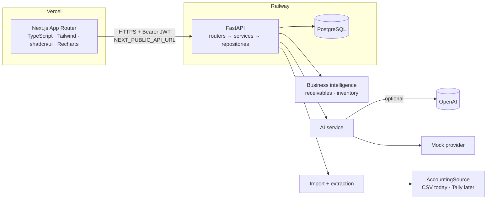

# Architecture



## Frontend (`frontend/`)
- Next.js App Router, all data pages are client components that fetch through one API layer.
- `lib/api/config.ts` resolves the backend URL from `NEXT_PUBLIC_API_URL` (server-side code may override
  with `API_URL`). `lib/api/client.ts` adds the bearer token, maps the error envelope to `ApiError`,
  and signs the user out on 401. `lib/api/endpoints.ts` is the only place that knows route paths.
- `hooks/use-async.ts` gives every page the same loading / error / retry behaviour; `components/page-state.tsx`
  provides the loading, empty and error views.
- Auth: the JWT is kept in `localStorage` and sent as `Authorization: Bearer`. Because the frontend
  (vercel.app) and API (up.railway.app) are different sites, cookies would be third-party cookies, which
  Safari and Chrome increasingly block. The trade-off is that the token is readable by any script in
  the page (XSS), so the app renders no untrusted HTML and tokens expire after 12 hours.
- Money is never calculated in the browser; it renders what the API returns.

## Backend (`backend/app/`)
| Layer | Responsibility |
|-------|----------------|
| `api/` | HTTP only: parse, authorise, call a service, shape the response |
| `schemas/` | Pydantic request/response models (money serialises as JSON numbers) |
| `services/` | Business logic. `receivables.py` and `inventory.py` are pure functions with no DB or LLM |
| `repositories/` | The SQL that loads invoice facts, sales velocity and stock |
| `models/` | SQLAlchemy 2 models, UUID primary keys |
| `core/` | settings, DB engine, password hashing/JWT, error envelope |

Errors always use `{"error": {"code", "message", "details"}}`. Unhandled exceptions are logged server-side
and returned as a generic message, with no stack traces, SQL or paths. In production `/docs` is disabled.

## Database
Tables: `users`, `customers`, `products`, `inventory`, `invoices`, `invoice_items`, `payments`,
`reminder_logs`. `CustomerPaymentBehavior` is *not* persisted: it is derived from invoices and payments on
each request, which avoids a second source of truth. Invoice `overdue` is derived too. Schema changes go
through Alembic (`backend/alembic`); the app never calls `create_all` at runtime.
`DATABASE_URL` accepts Railway's `postgres://` / `postgresql://` form and is adapted to the psycopg 3 driver.

## AI
```
question ──► retrieve facts (SQL + pure functions) ──► provider ──► validate ──► user
```
- `AIProvider` (`services/ai/provider.py`) has `answer`, `explain_priority`, `write_reminder`.
  `OpenAIProvider` is the only module importing the OpenAI SDK; `MockAIProvider` renders deterministic
  templates and needs no key.
- `AIService` wraps the configured provider: if the call fails, or the output fails validation, it
  returns the mock result and flags `fallback_used`.
- Validation (`ai/validation.py`): every number in an answer must appear in the supplied facts;
  reminders must contain the real invoice number and amount, stay short, and avoid threatening or
  promise-implying phrases.
- The assistant (`services/assistant.py`) routes questions by keyword to a fixed set of fact
  retrievers. Questions outside receivables, collections, inventory and invoices get a fixed reply, not an LLM call.
- Reminders are drafts. `POST /api/ai/collection-message/send` requires `approved: true`, records the
  approval in `reminder_logs`, and returns a `wa.me` link. VyapaarOS never sends the message itself.
  A WhatsApp Business API provider can implement `WhatsAppProvider`.

## Import and extraction
- **Extraction** (`services/extraction/`): `InvoiceExtractor` implementations (structured JSON, text PDF)
  produce `ExtractedInvoice`; the resolver maps customer names and SKUs onto real records and reports
  every unresolved item. Image/scanned documents are rejected with a clear message (no OCR).
- **Import** (`services/importing/`): `AccountingSource` → `ImportService`. Preview validates without
  writing; commit re-validates and writes only valid rows. Invoices import as drafts.
- Everything that creates an invoice produces a **draft**. Approval (owner/manager) moves it into the
  business dataset and deducts stock. Reject keeps it out forever.
- Future Tally adapter: see [integrations/tally.md](integrations/tally.md).

## Security
bcrypt password hashes; JWT with expiry; role checks for approve/reject/import-commit; no wildcard CORS
(origins from `CORS_ORIGINS`); upload size and row limits; file-type checks; ORM-only queries; secrets only
via environment; AI output validated before display; explicit approval before any customer message.

## Scalability notes
The receivables snapshot is computed per request from two aggregate queries, fine up to tens of
thousands of invoices. Beyond that: materialise per-customer aggregates, add pagination to the
collections table, and move imports to a background worker. The API is stateless, so it scales
horizontally on Railway.
